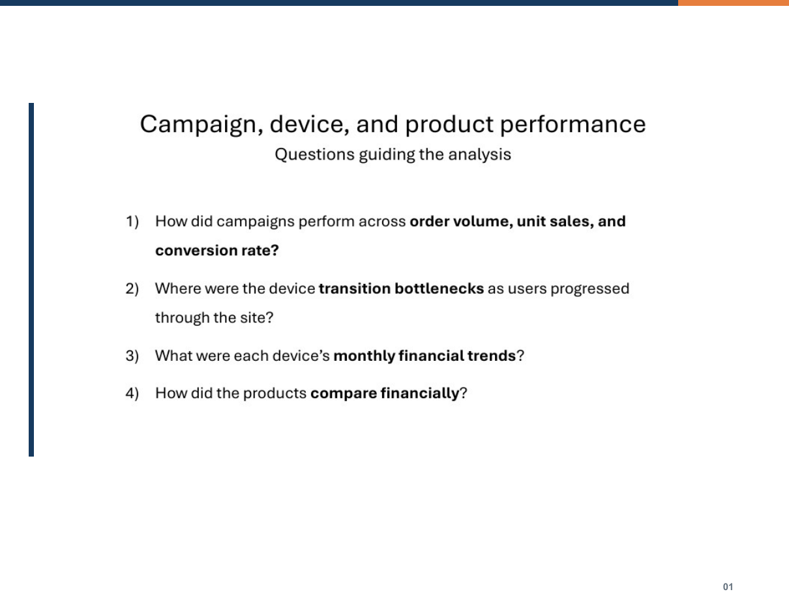
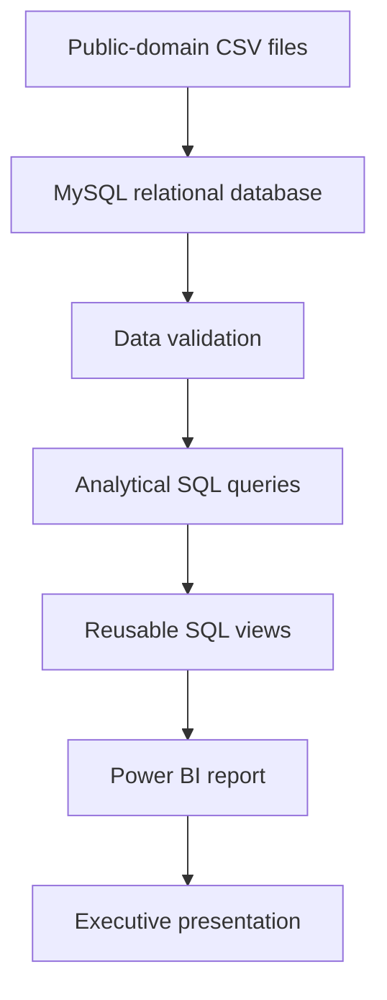
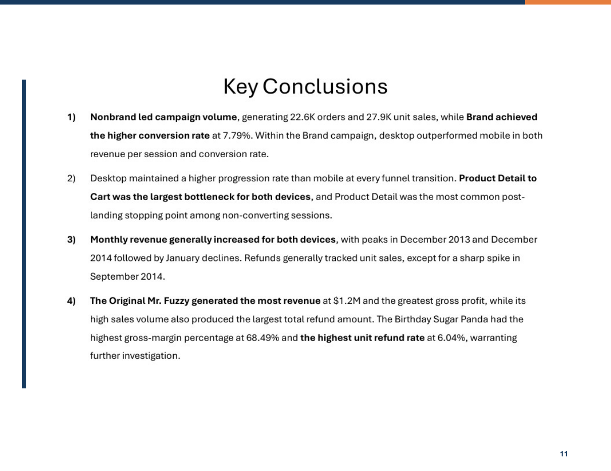

# Maven Fuzzy Factory E-Commerce Analysis



An end-to-end business intelligence project analyzing marketing campaigns, website conversion behavior, monthly financial performance, and product economics for a fictional online retailer.

The project demonstrates a complete workflow from raw CSV files to a relational MySQL database, data validation, reusable analytical views, Power BI visualization, and an executive presentation.

## Business questions

1. How did campaigns perform across order volume, unit sales, and conversion rate?
2. Where were the device transition bottlenecks as users progressed through the site?
3. What were the monthly financial trends for desktop and mobile traffic?
4. How did the products compare financially?

## Tools

- **MySQL:** schema design, bulk loading, validation, analysis, and reporting views
- **Power BI:** data modeling, measures, and business visualizations
- **Power Query:** data preparation and display fields
- **PowerPoint:** executive presentation of the findings
- **GitHub:** project documentation and version control

## Analysis workflow



## Key findings

- **Nonbrand led campaign volume**, generating 22.6K orders and 27.9K unit sales. Brand achieved the higher conversion rate at 7.79%.
- **Desktop outperformed mobile throughout the funnel.** Product Detail to Cart was the largest transition bottleneck for both devices.
- **Revenue generally increased over time** for both devices, with peaks in December 2013 and December 2014 followed by January declines.
- **The Original Mr. Fuzzy generated the most revenue and gross profit.** Its high sales volume also produced the largest total refund amount.
- **The Birthday Sugar Panda had the highest gross-margin percentage** at 68.49% and the highest unit refund rate at 6.04%, making it the clearest product-specific follow-up opportunity.



## Repository structure

```text
maven-fuzzy-factory-analysis/
├── README.md
├── LICENSE
├── DATA_SOURCE.md
├── sql/
│   ├── 01_create_database.sql
│   ├── 02_load_data.sql
│   ├── 03_validate_data.sql
│   ├── 04_analyze_data.sql
│   ├── 05_create_views.sql
│   └── 06_test_views.sql
├── data/
│   ├── data_dictionary.csv
│   ├── raw/
│   │   ├── README.md
│   │   └── maven_fuzzy_factory_raw_data.zip
│   └── analysis_exports/
│       └── 01-09 SQL view exports
├── power-bi/
│   ├── Maven_Fuzzy_Factory.pbix
│   └── README.md
├── presentation/
│   ├── Maven_Fuzzy_Factory_Analysis.pdf
│   └── Maven_Fuzzy_Factory_Presentation.pptx
├── docs/
│   ├── Results_Interpretation.pdf
│   └── Storyboard.pdf
└── images/
    ├── project_cover.png
    └── key_conclusions.png
```

## Database setup

### Requirements

- MySQL 8.0 or later
- A MySQL client with `LOCAL INFILE` enabled
- Power BI Desktop to open or refresh the `.pbix` file

### Reproduce the analysis

1. Clone or download this repository.
2. Extract `data/raw/maven_fuzzy_factory_raw_data.zip` into `data/raw/`.
3. Open a terminal in the repository root, or update the paths in `sql/02_load_data.sql` for your environment.
4. Run the SQL files in numeric order:

```text
01_create_database.sql
02_load_data.sql
03_validate_data.sql
04_analyze_data.sql
05_create_views.sql
06_test_views.sql
```

When using the MySQL command-line client from the repository root:

```bash
mysql --local-infile=1 -u YOUR_USERNAME -p < sql/01_create_database.sql
mysql --local-infile=1 -u YOUR_USERNAME -p < sql/02_load_data.sql
mysql --local-infile=1 -u YOUR_USERNAME -p < sql/03_validate_data.sql
mysql --local-infile=1 -u YOUR_USERNAME -p < sql/04_analyze_data.sql
mysql --local-infile=1 -u YOUR_USERNAME -p < sql/05_create_views.sql
mysql --local-infile=1 -u YOUR_USERNAME -p < sql/06_test_views.sql
```

MySQL Workbench users may need to replace the relative file paths in `02_load_data.sql` with absolute paths and enable `OPT_LOCAL_INFILE` for the connection.

## Power BI report

The Power BI report connects to nine MySQL views created by `05_create_views.sql`:

- `vw_campaign_conversion`
- `vw_product_by_campaign`
- `vw_campaign_device_and_source_success`
- `vw_page_ending_validation`
- `vw_furthest_stage_for_non_orders`
- `vw_device_funnel`
- `vw_product_profitability`
- `vw_product_refunds`
- `vw_monthly_device_performance`

To refresh the report on another computer, create the database and views first, then open the report and update the MySQL data-source settings and credentials. See [`power-bi/README.md`](power-bi/README.md) for details.

## Analytical caveat

Refunds in the monthly analysis are grouped by the month in which the refund occurred. A monthly refund is not necessarily associated with an order placed during that same month.

## Data source

The project uses the **Toy Store E-Commerce Database** from the Maven Analytics Data Playground. Maven Analytics identifies the dataset as Public Domain. See [`DATA_SOURCE.md`](DATA_SOURCE.md) for attribution and the source link.

## Author

**Connor Irvine**  
Data analytics and business intelligence portfolio project

## Development Notes

Generative AI was used as a supporting tool during portions of this project for troubleshooting, documentation, and implementation guidance. Analytical decisions, data validation, interpretation of results, and final project review were performed by the author.
